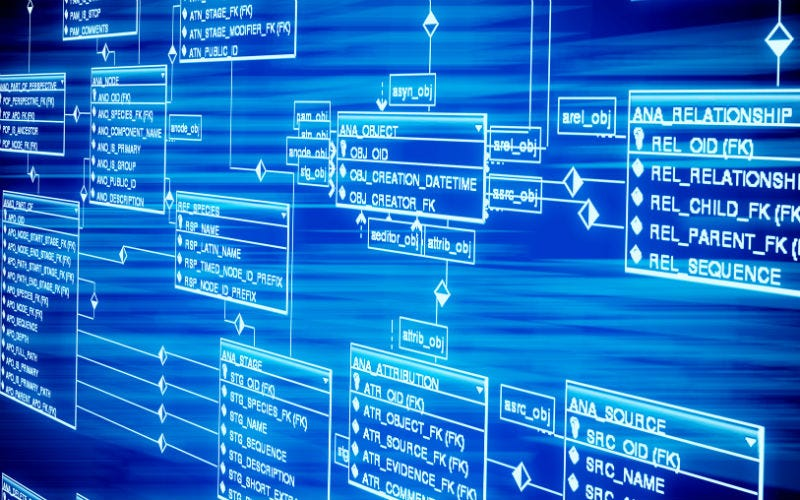
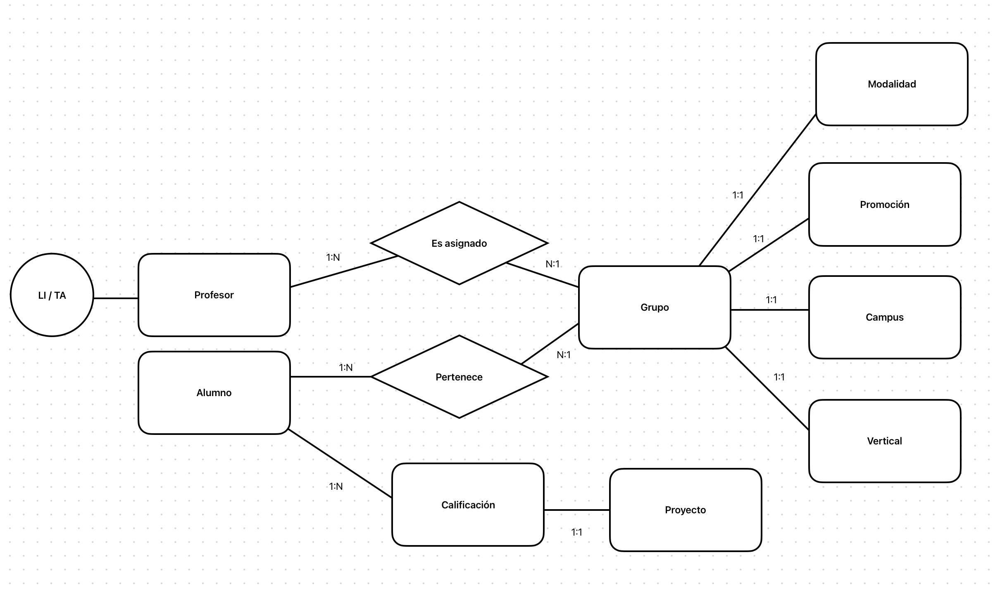
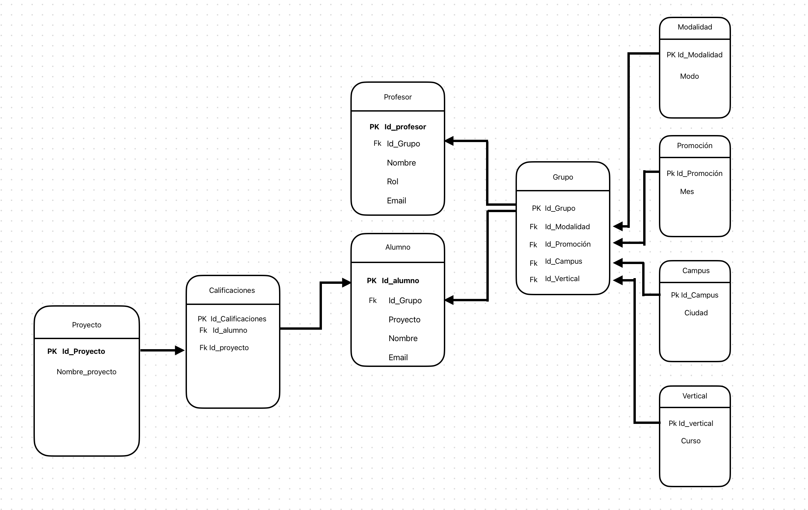
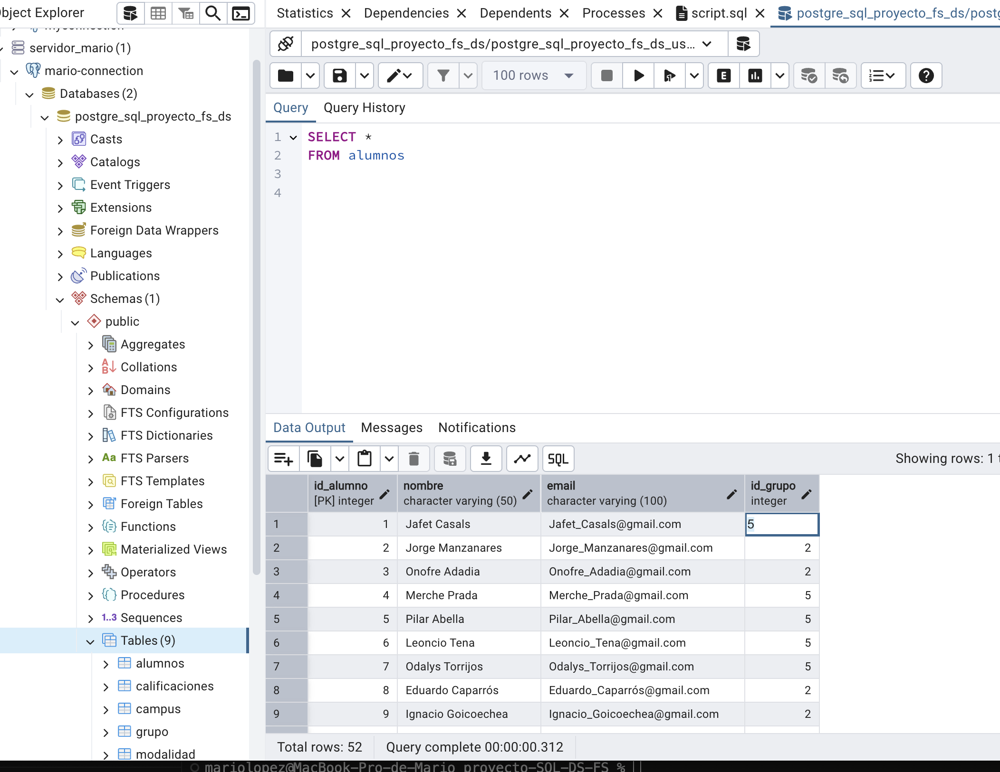
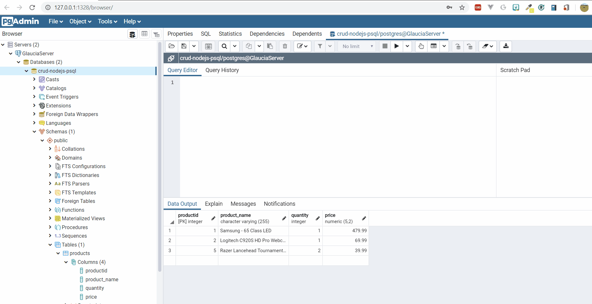

# Proyecto con base de datos DS 🤝🏻 FS

## 🗃️ SQL

📑 Descripción
Este proyecto tiene como objetivo diseñar y construir una base de datos relacional a partir de un conjunto de datos sin normalizar que representa a los estudiantes y profesores de una escuela de bootcamps. La finalidad es aplicar principios de modelado de datos y normalización para obtener una estructura eficiente, escalable y funcional.

- Este ejercicio proporciona experiencia práctica en:

- Análisis y modelado de datos

- Normalización

- Diseño de bases de datos relacionales

- Implementación en PostgreSQL

- Uso de servicios en la nube con Render para bases de datos

## 💪🏻 Equipo:

- Eric Emilio Castro 🧔🏻‍♀️
- Rafael Cercós 🧒🏻
- Mario L. Clavero 👨🏻‍🦲

## 🔧 El proyecto consiste en realizar:

### 🔗 Modelo Entidad-Relación (E/R)
Diseñar un diagrama E/R que represente la estructura lógica del sistema.

Identificar correctamente las entidades, sus atributos y las relaciones entre ellas.

### 🧠 Modelo Lógico de la Base de Datos
   
A partir del modelo E/R, definir el modelo lógico:

- Estructura de tablas

- Campos y tipos de datos

- Claves primarias y claves foráneas

### 📊 Normalización de Datos
Aplicar las reglas de normalización para:

- Evitar la redundancia de los datos.
- Disminuir problemas de actualización de los datos en las tablas.
- Proteger la integridad de los datos.
- Facilitar el acceso e interpretación de los datos.
- Reducir el tiempo y complejidad de revisión de las bases de datos.
- Optimizar el espacio de almacenamiento.
- Prevenir borrados indeseados de datos.

### 🗂️ Gestión de la Base de Datos

Para la gestión de la base de datos, se ha utilizado pgAdmin, una herramienta de administración y desarrollo para bases de datos PostgreSQL.

### ✅ Queries de prueba

En esta sección se incluyen una serie de consultas SQL que se han utilizado para verificar el correcto funcionamiento de la base de datos y sus relaciones. Estas consultas están diseñadas para obtener, manipular y analizar los datos, asegurando que la estructura de la base de datos y las operaciones sobre ella sean eficientes y precisas.

Las queries de prueba incluyen ejemplos de:

- 🔎 Consultas básicas para obtener datos de las tablas.

- 🖇️ Consultas con joins para combinar información de diferentes tablas.

- 🧩 Filtros y condiciones para mostrar datos específicos.

- 🤔 Agregaciones como sumas, promedios y contajes.

Estas consultas son útiles para validar la integridad de la base de datos y pueden servir como punto de partida para futuras operaciones o como base para consultas más complejas.

